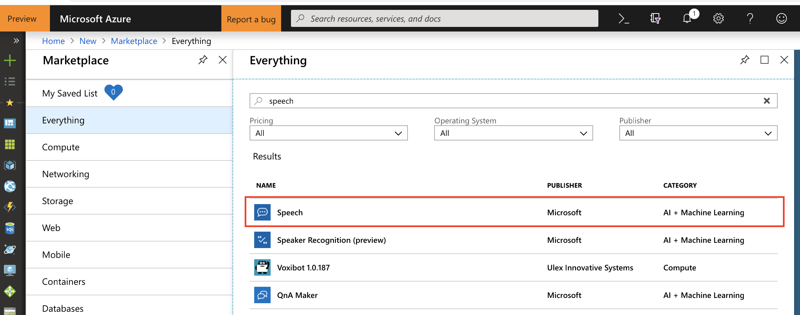

# Hints for Speech-to-Text challenge

Create a new `Python 3.6 Notebook` in [Azure Notebooks](https://notebooks.azure.com/). Next, create a `Speech` API Key in the Azure Portal:



As region, we'll be using `West Europe` in this example. You can find your API key under the service, then `Keys`.

## Speech-to-Text

First, we need to request a token from the `Issue Token endpoint` of the Speech API. Each token is valid for 10 minutes, hence we can either reuse it multiple times (to minimize network traffic and latency), or request a new one for each call:

```python
import requests, json

api_key = "xxx" # Enter your API key here

token_url = "https://westeurope.api.cognitive.microsoft.com/sts/v1.0/issuetoken"
headers = {'Ocp-Apim-Subscription-Key': api_key}

response = requests.post(token_url, headers=headers)
token = response.text

print("Token: " + token)
```

Now that we have a token, we can call the speech-to-text endpoint and include the `wav` data

```python
url = "https://westeurope.stt.speech.microsoft.com/speech/recognition/conversation/cognitiveservices/v1"

headers = {'Authorization': 'Bearer ' + token,
           'Accept': 'application/json',
           'Ocp-Apim-Subscription-Key': api_key,
           'Content-Type': 'audio/wav; codec=audio/pcm; samplerate=16000'}

params = {'language': 'en-US', 'format': 'detailed'}

with open("test.wav", 'rb') as f:
    data = f.read()

response = requests.post(url, headers=headers, params=params, data=data)
print(json.dumps(response.json(), indent=2))
```

***Note:***

As of May 2019, also compressed audio is supported (e.g., MP3s), see [here](https://docs.microsoft.com/en-us/azure/cognitive-services/speech-service/how-to-use-codec-compressed-audio-input-streams),

Besides that, the speech-to-text API expects audio with the following specifics:
* 16-bit WAV format with PCM or OGG format with OPUS
* Single channel (mono) at 8 or 16 KHz

More details, see [here](https://docs.microsoft.com/en-us/azure/cognitive-services/speech-service/how-to-use-audio-input-streams).